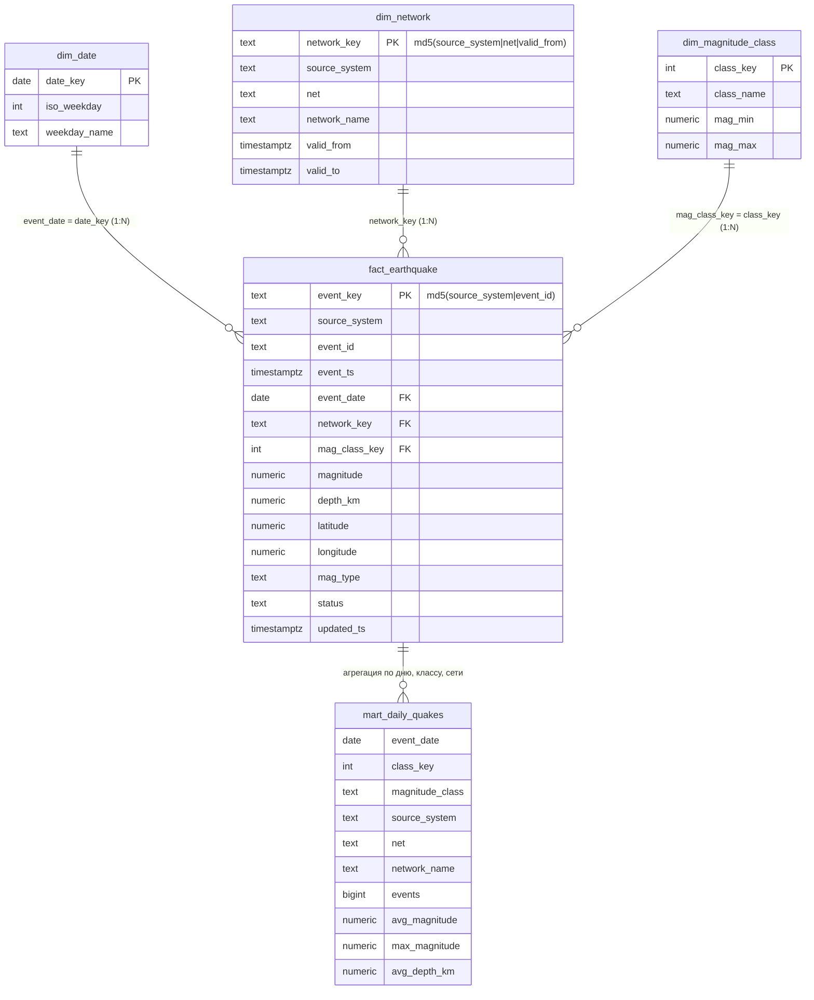

# ДЗ2 — nvtukhlin — DWH и ELT: землетрясения USGS → PostgreSQL + dbt + Airflow

Отчёт с результатами, таблицей четырёх случаев и выводами — [`report.md`](report.md).
Скриншоты — [`screenshots/`](screenshots/), тексты выводов — [`evidence/`](evidence/).

## Источник и контрольный срез

- **Источник:** USGS Earthquake Catalog (ComCat), FDSN Event API
  Документация: https://earthquake.usgs.gov/fdsnws/event/1/
- **Срез:** события M≥2.5, время события с 2025-03-03 00:00:00 UTC (включительно) до 2025-03-06 00:00:00 UTC (исключительно), 212 строк.
  ```
  https://earthquake.usgs.gov/fdsnws/event/1/query?format=csv&starttime=2025-03-03&endtime=2025-03-06&minmagnitude=2.5&orderby=time-asc
  ```
  Файл зафиксирован в репозитории: `data/slice/usgs_20250303_20250306.csv`, время скачивания — `data/slice/FETCHED_AT.txt`.
  Значения `updated` и магнитуды USGS пересматривает, поэтому сравнивать нужно с зафиксированным файлом, а не с новым скачиванием.
- **Поля:** `time` (UTC, ISO 8601 с `Z`), `latitude`/`longitude` (градусы), `depth` (км, может быть отрицательной), `mag` (безразмерная), `magType`, `net` (код сети-источника), `id`, `updated` (UTC), `place`, `type` (`earthquake` / `mining explosion`), `status`, остальные поля точности хранятся в raw без разбора.
- **Временная зона:** всё в UTC; `event_date` = календарная дата события в UTC.
- **Справочник сетей** `data/slice/network_history.csv` — 9 кодов сетей, встречающихся в срезе, с названиями по общедоступным описаниям сетей-участников USGS. Истории переименований в источнике нет, поэтому у каждой сети одна версия `1900-01-01 … 9999-12-31`.

## Требование

- **Потребитель:** дежурный аналитик сейсмомониторинга.
- **Вопросы:** 1) сколько землетрясений M2.5+ за каждые сутки UTC по классам магнитуды, какие макс. магнитуда и средняя глубина; 2) какие сети дают наибольшую долю событий по дням.
- **MVP:** витрина `mart.daily_quakes` («день × класс магнитуды × сеть»), обновляемая одним запуском DAG с проверками качества и без публикации при их провале.
- **Что считается:** событие — запись со `type = 'earthquake'` в актуальной версии; `mining explosion` из факта исключается бизнес-правилом (в срезе 2 таких строки). Классы магнитуды — шкала из `dbt/seeds/mag_class.csv` (micro <2, minor 2–4, light 4–5, moderate 5–6, strong 6–7, major 7–8, great ≥8; нижняя граница включается, верхняя нет).

## Модель

**Гранулярность.** Одна строка факта `dds.fact_earthquake` — это одно сейсмособытие, идентифицируемое парой (`source_system`, `event_id`), в его актуальной версии (по `updated`). Одна строка витрины — один день (UTC) × класс магнитуды × версия сети-источника.



Кардинальность: событие имеет ровно одну сеть на момент события (SCD2-интервалы не пересекаются — проверяется тестом), один класс магнитуды и одну дату; у сети, класса и даты — много событий.

**Почему размерная модель (звезда).** Отчёт агрегирующий («сколько, какая доля, какая макс. магнитуда» по дням и категориям), источник один, измерения малы и плоские, поэтому звезда даёт простые join-ы и понятную кардинальность. Data Vault и якорное моделирование окупаются, когда много источников и часто меняется структура — здесь это лишняя сложность; снежинка не нужна, у измерений нет собственных подизмерений. Другой подход понадобился бы, если бы требовалось объединять десятки сейсмических каталогов с разными идентификаторами (тогда — детальный слой в стиле Data Vault) или отвечать на вопросы о цепочке пересмотров события (тогда — полноценная версионная факт-таблица).

**Решение по истории.**
- `dim_network` — SCD2 (`valid_from`, `valid_to`, полуоткрытый интервал): если сеть переименуют или передадут другому оператору, прошлые дни должны остаться с прежним названием. Факт присоединяет версию по `net` и времени события. Тесты: нет пересечений интервалов и ровно одна версия сети на событие.
- Классы магнитуды — справочник без истории (тип 0); при смене методики его нужно версионировать так же.
- Пересмотр самого события (изменилась магнитуда) — не история измерения, а «актуальное состояние»: в ODS хранятся все версии (`stg.stg_event_versions`), в факт попадает последняя по `updated`, затем по порядку загрузки (`stg.stg_events_latest`).
- Реальной истории атрибутов сетей в источнике нет; версии для проверки пересечения добавляются только в явно помеченном синтетическом входе `data/tests/overlap`.

## Слои

Физически всё в одной БД `dwh`, слои разведены схемами:

| Слой | Схема.таблицы | Что делает |
|---|---|---|
| Raw | `raw.usgs_events`, `raw.network_history` | данные «как есть», все поля text + метки `_source_system`, `_slice_id`, `_slice_order`, `_row_num`, `_is_synthetic` |
| ODS | `stg.stg_event_versions`, `stg.stg_events_latest`, `stg.stg_network_history` | типы, UTC, ключ `event_key`, окно дат, все версии и актуальное состояние |
| DDS | `dds.dim_network`, `dds.dim_magnitude_class`, `dds.dim_date`, `dds.fact_earthquake` (+ `seed.mag_class`) | измерения и факт |
| Витрина-кандидат | `mart_candidate.mart_daily_quakes` | результат dbt, на нём бегут тесты |
| Публикация | `mart.daily_quakes`, `mart.publication_log` | то, что видит потребитель |

Количество строк по слоям — `evidence/layers.txt`.

## Роли инструментов и почему это ELT

Данные загружаются в PostgreSQL сразу как есть (Extract + Load), а все преобразования (типизация, дедупликация, join, агрегаты) выполняются SQL-ом внутри БД (Transform). **PostgreSQL** хранит и исполняет SQL; **dbt** описывает модели (`ref()`, `source()`) и тесты, но сам данных не хранит; **Airflow** только управляет порядком и запуском (`load_raw → dbt_build_candidate → dbt_test → publish`) и показывает состояния. В графе видны стадии и то, какая упала; какой именно тест и сколько строк нарушили — в логе задачи `dbt_test` и в таблицах `dbt_test_audit.*`.

## Обрабатываемый интервал

DAG принимает параметры `start_date` и `end_date` (даты **события**, UTC, `[start, end)`), по умолчанию `2025-03-03` … `2025-03-06`. Ручной запуск обрабатывает именно это окно: staging фильтрует по `event_date` из данных, а публикация заменяет в `mart.daily_quakes` только строки этого окна. Дата запуска (`logical_date`, `run_id`) нигде не подставляется вместо даты события; `run_id` попадает только в `publication_log`.
При ежедневном расписании (например, 02:00 UTC) обрабатывалось бы окно `[data_interval_start − 3 дня, data_interval_end)`: предыдущие сутки плюс два дня запаса на запоздавшие правки USGS; публикация перезаписывает окно целиком, поэтому повтор безопасен. В работе расписание отключено (`schedule=None`).

## Версии

Airflow 2.11.2 (образ `apache/airflow:2.11.2-python3.12`, LocalExecutor), PostgreSQL 17 (`postgres:17-alpine`), dbt-core 1.12.5, dbt-postgres 1.11.0 (в отдельном venv `/home/airflow/dbt-venv`), Python 3.12, Docker Compose v5, Docker 29. Проверено на macOS (Docker Desktop/OrbStack, aarch64).

## Запуск с нуля

Требуется Docker с Compose v2+. Все команды из папки `nvtukhlin-hw02/`.

1. Секреты: `cp .env.example .env` и заменить все `changeme` собственными значениями (любые пароли; `AIRFLOW_FERNET_KEY` — base64 от 32 случайных байт, например `python3 -c "import base64,os;print(base64.urlsafe_b64encode(os.urandom(32)).decode())"`; `AIRFLOW_SECRET_KEY` — любая случайная строка). Файл `.env` в git не попадает.
2. Сборка и запуск: `docker compose build && docker compose up -d`. Дождаться, пока `docker compose ps` покажет `airflow-init` как `Exited (0)`, а веб-сервер как `Up`.
3. Airflow UI: http://127.0.0.1:8080 (логин и пароль из `AIRFLOW_ADMIN_USER` / `AIRFLOW_ADMIN_PASSWORD`). Хранилище: `127.0.0.1:5433`, БД `dwh`, пользователь из `WAREHOUSE_USER`. Порты привязаны только к `127.0.0.1`.
4. Успешный прогон: `./run_dag.sh my_first_run` (или кнопка Trigger DAG w/ config в UI). Скрипт запускает DAG, ждёт завершения и печатает состояния задач.
5. Результат: `./psql.sh < sql/queries.sql` (psql выполняется внутри контейнера хранилища).
6. Независимая сверка с источником: `docker compose exec -T airflow-scheduler python /opt/project/loader/independent_check.py`.
7. Повтор на одинаковом входе и сравнение:
   ```bash
   docker compose exec -T airflow-scheduler python /opt/project/loader/qa.py snapshot a
   ./run_dag.sh repeat_run
   docker compose exec -T airflow-scheduler python /opt/project/loader/qa.py snapshot b
   docker compose exec -T airflow-scheduler python /opt/project/loader/qa.py compare a b
   ```
8. Диагностические случаи: `./run_dag.sh <run_id> <case>`, где `<case>` — `dup`, `overlap`, `late`, `source_b` или `corrupt` (можно списком через запятую). `run_id` должен быть уникальным. После каждого опыта — запуск без случая, например `./run_dag.sh restore_1`: raw полностью пересоздаётся из baseline, и публикация возвращается к исходному состоянию.
9. Остановка: `docker compose down` (данные сохраняются); полная очистка — `docker compose down -v`.

Синтетические входы для случаев собираются скриптом `data/tests/build_cases.py` из реального среза (`python3 data/tests/build_cases.py`); папки `data/tests/*` уже лежат в репозитории.

## Структура

```
docker-compose.yml, Dockerfile, .env.example
run_dag.sh, psql.sh                       вспомогательные скрипты запуска
airflow/dags/quakes_elt.py                DAG
loader/load_raw.py                        загрузка raw (truncate + copy выбранных срезов, одна транзакция)
loader/publish.py, sql/publish.sql        публикация окна в mart.* под advisory lock
loader/qa.py, loader/independent_check.py снимки/сравнение повторов, независимый расчёт по CSV
dbt/                                      проект dbt: models (staging, dds, marts), seeds, tests, macros
sql/queries.sql                           запросы потребителя к витрине
data/slice/                               реальный срез, справочник сетей, время скачивания
data/tests/                               синтетические входы (dup, overlap, late, source_b, corrupt) и генератор
screenshots/, evidence/, report.md
```
